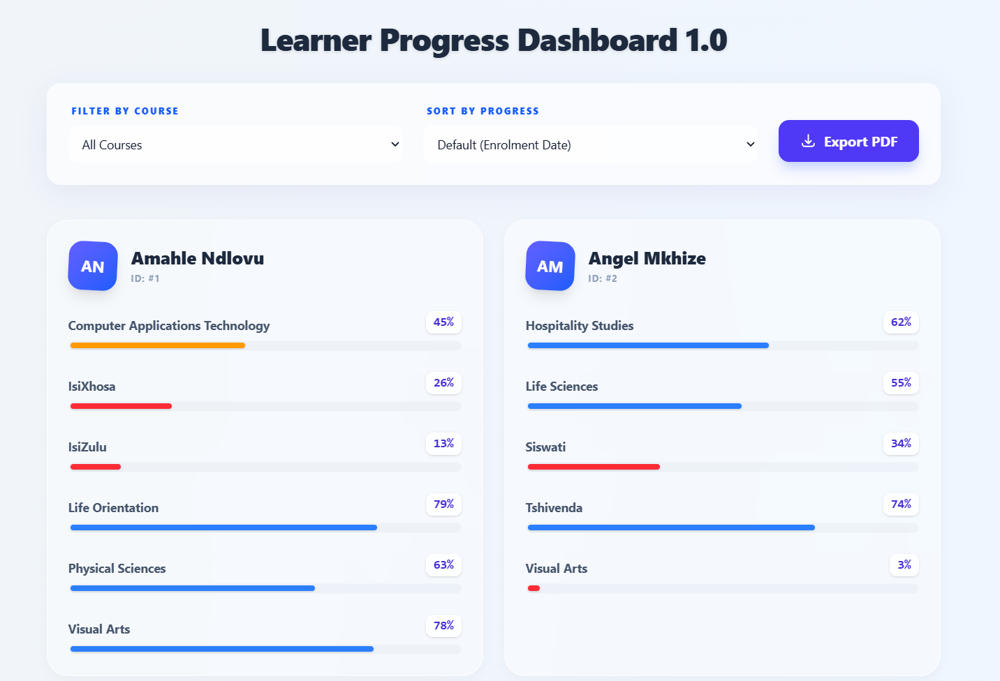
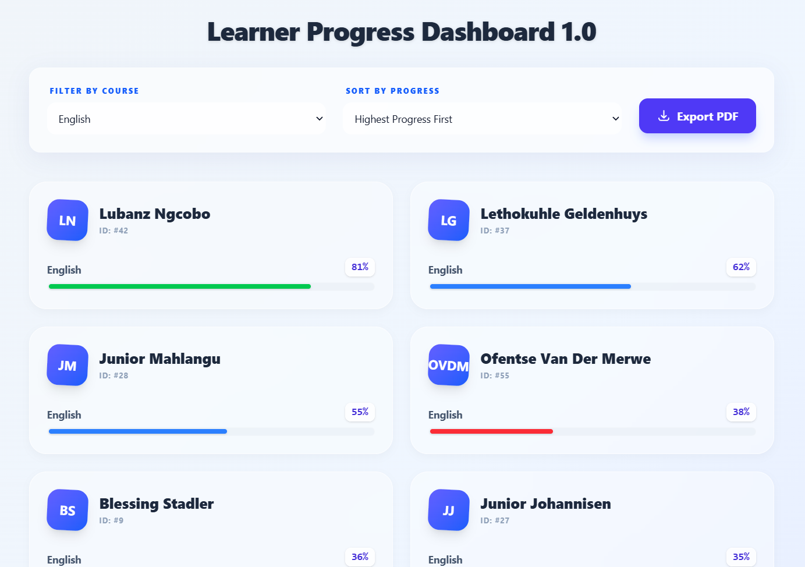
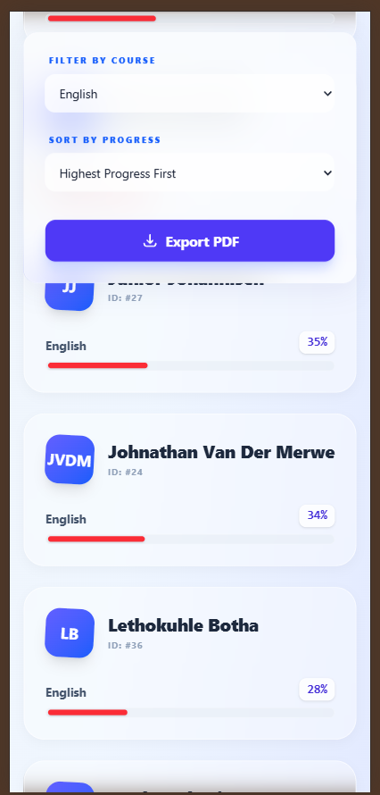

# Learner Progress Dashboard - Coding Challenge

The goal of this coding challenge is to add some new functionality to the given simple full-stack web application to allow a user to view learner course progress on a new dashboard. The dashboard should allow basic filtering.

## Tech stack

```
Laravel 12
PHP 8.5
SQLite
Inertia/Vue 3
Tailwind CSS v4
```

## Getting Started

### Getting your environment ready

Before you start. Ensure that you have all these extensions enabled in your `php.ini` configuration file for a smooth Laravel 12 experience.

```
openssl
curl
fileinfo
mbstring
pdo_sqlite
sqlite3
pdo_mysql
```

Also, if you are on PHP 8.5, you might want to update your `./config/database.php` file with this, if you haven't done so already.

```
Find: Lines 61 and 81 (and anywhere else PDO::MYSQL_ATTR_SSL_CA appears).
Change: PDO::MYSQL_ATTR_SSL_CA To: Pdo\Mysql::ATTR_SSL_CA
```

This ensures you don't see warning messages like this:
```
Deprecated: Constant PDO::MYSQL_ATTR_SSL_CA is deprecated since 8.5, use Pdo\Mysql::ATTR_SSL_CA instead in 
./config/database.php on line 61
```

Why this is happening?

`In PHP 8.5, the development team moved MySQL-specific constants into their own namespace (Pdo\Mysql) to clean up the global space. Laravel 12's default database.php still uses the old global PDO:: prefix`

### Running the solution

#### The Server/API - Laravel

1. Clone the code/repo from here `git clone https://github.com/itwizz26/valenture-learner-dashboard.git`
2. Change onto the new repo directory `cd valenture-learner-dashboard`
3. Run `composer install`
4. Configure your `.env` file from the example. Ensure this SQLite database connection string is present inside your .env `DB_CONNECTION=sqlite`. Make sure the database.sqlite file exists. Run `touch database/database.sqlite`
5. Generate the App Key: `php artisan key:generate`
6. Run migrations and seeders: `php artisan migrate --seed`
7. Start the development server: `php artisan serve`

***NB**: On a fresh Linux install, you might also want to run this `mkdir -p storage/framework/{sessions,views,cache}` - Sometimes these folders are missing from git clones and can cause a 500 error on the first run.*

Now head on to your favourite browser and open [http://localhost:8000/](http://localhost:8000) to see your new Laravel 12 app or open this link to check the server status [http://localhost:8000/up](http://localhost:8000/up)

#### The Client/UI - Vue.js

1. Run `yarn install`
2. Run `yarn run build`
3. Run `yarn run dev`

*NB: Run yarn dev for local development with Hot Module Replacement, or yarn build to compile assets for production.*

### Testing the app

Visit [Leaner-progress](http://localhost:8000/learner-progress) in your browser and click around. Happy browsing!

## Screens

You should now see a User Interface exacly like the below.

Default view



Filtered view (By English)



Fully resposive



### Code Quality

To maintain high code quality and PSR-12 compliance, this project uses **Laravel Pint**. 

To run the linter and check any code smells, do this:

```
chmod +x ./vendor/bin/pint (give Pint execute permissions just once)
./vendor/bin/pint
```

Furthermore, the linter has been added as a GitHub action to run a check every time we push code to the repository.

### Technical Decisions & Architecture

#### Architecture & Patterns

I opted for a `Service-Repository Pattern` even though it's a challenge. Why? Because "Fat Controllers" are where technical debt goes to hide.

- **Controller**: Just the traffic cop. It validates the request and asks the Service for data.

- **Repository Layer (ISP & DIP)**: Abstracts the data fetch. By using a `LearnerRepositoryInterface`, I've ensured the system adheres to the *Interface Segregation Principle (ISP)* - the application only depends on specific methods it actually needs. It also demonstrates the *Dependency Inversion Principle (DIP)* and *Inversion of Control (IoC)*, as the high-level Service depends on an abstraction rather than a concrete SQLite implementation.

- **Service Layer (SRP)**: Encapsulates the business logic. This follows the *Single Responsibility Principle (SRP)* by ensuring the Controller only handles HTTP concerns while the `ProgressService` handles the logic for data transformation and filtering.

- **Performance (N+1 Prevention)**: I solved the N+1 problem using Eager Loading `(with(['courses']))` and handled the progress sorting at the Database Level (SQL Joins) rather than in PHP memory. This ensures the app stays snappy even if the learner count hits the thousands.

- **Strict Typing**: Every class uses `declare(strict_types=1)` and full type-hinting to ensure code reliability and better IDE support.

- **Bonus - PDF Export Logic (OCP)**: Implemented using dompdf. The system demonstrates the *Open/Closed Principle (OCP)*; we were able to extend the application's functionality (adding PDF generation) by reusing the existing `ProgressService` logic without needing to modify the service's core filtering code.

#### Frontend UI decisions

- **Yarn over NPM**: I chose Yarn due to its dependency resolution which prevents version conflicts between different packages and better caching mechanism.

- **Inertia.js**: Chosen to provide a Single Page Application (SPA) experience without the complexity of a separate API/JWT setup.

- **Tailwind v4 JIT**: Utilised the latest CSS engine for high-performance styling and minimal bundle size. Also makes the glassmorphic dashboard UI render faster on mobile devices.

- **Vite**: Compiles and caches css and js in `./public/build/assets/` (our overall SPA loads faster)

### Future Improvements

Given the decoupled architecture, I would implement a test suite using PHPUnit 12, utilising Mockery to unit test the ProgressService against the LearnerRepositoryInterface. This would ensure 100% coverage of the business logic without the overhead of database migrations in the test cycle.

### Copyright

[Itwizz26](https://github.com/itwizz26/) <|> [Daniel Mathebula](https://portfolio-c08.pages.dev/) <|> &copy; 2026

### License

[GNU GENERAL PUBLIC LICENSE](LICENSE)
